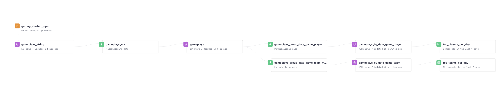

# About

This is a POC to show how a video-game company could use Tinybird to do real-time analytics and have updated leaderboards for teams and players in their platform.

## Installation and running the project

Create a virtual environment and install the necessary packages

```bash
python3 -mvenv .e # creates environment in
.e/bin/activate # activates environment
pip install -r requirements.txt
```

To replicate the project on your Tinybird account, run
```bash
tb auth # will ask you for you auth token
tb push # will create all the Data Sources, Materialized Views and endpoints in your account
tb datasource append gameplays_string https://storage.googleapis.com/tinybird-assets/datasets/demos/games-analytics/gameplays.csv
```
After this, a token named 'games_demo_poc' will be created in your account as well, that will give you access to two dynamic API endpoints: one for a players leaderboard and one for a teams leaderboard. Both will be accessible from a [URL like this](https://api.tinybird.co/endpoints?token=p.eyJ1IjogImU3NWNmMjUxLThlNjctNGRlOC1iM2FlLTdmMzhlZGIwODdmOSIsICJpZCI6ICJhYjY4OWQ0OS0zODFhLTQzNmYtOTZjZS0zNGFmMWI0MGE4OTQifQ.xNAZcDBP-M_fnOcyw7J3QkpOZEzB5IJAWTqyJqrx8pM) also

## Generating data by yourself

If you want to use the data we've generated already and is available in [this bucket](https://console.cloud.google.com/storage/browser/tinybird-assets/datasets/demos/games-analytics), skip this section

You can generate data with the `generate_data.py` script:

```
> p generate_data.py --help                                                                                                                        
Usage: generate_data.py [OPTIONS]

Options:
  --date-start [%Y-%m-%d]
  --date-end [%Y-%m-%d]
  --num-games INTEGER
  -i, --include-start-date-in-filename BOOLEAN
  --format [json|csv]
  --help                          Show this message and exit.
```

We'll generate JSON data to show how to work with it on Tinybird. If your data is generated in CSV format already, you can ingest it directly to the `gameplays` datasource and you don't need the `gameplays_string` Data Source or the `gameplays_mv` pipe.

### Generate NDJSON data

To generate data for the month of may, run `sh generate_data_may.sh`. It'll create 100K gameplays for each day of may and save all data in a NDJSON file. Then, running `sh generate_data_june.sh` will create one independent NDJSON file with 100k gameplays for the first 10 days of June.

After doing this I uploaded all the data to this bucket on Google Cloud: https://console.cloud.google.com/storage/browser/tinybird-assets/datasets/demos/games-analytics

## The Tinybird project

### Generating the project structure
Runnig `tb init` will create the `datasources`, `endpoints`, `explorations` and `pipes` folders.

### Authenticating to your Tinybird account
Running `tb auth` will ask you for your admin token and will show you a link to https://ui.tinybird.co/tokens to copy it from there.

Then it'll create a `.tinyb` file in the directory you are with that info.

### Analyzing a data file to generate a Data Source schema
This is done by running `tb datasource generate <filename/url>`. In this case I passed the path of a local file.

#### If your data is in JSON format

If your data is in a NDJSON format, like in `gameplays_sample.ndjson`, need to convert it to a single String column CSV file to ingest it to Tinybird. Then, you'd create a materialized view on Tinybird to extract each value from that String column.

This would only be necessary if you generated the data manually. The data in Google Cloud is already in a compatible CSV format. However, if it wasn't, converting an ndjson-formatted file to CSV can be done with a command like this:

```bash
jq -r '[. | tostring] | @csv' data/gameplays_sample.ndjson  > data/gameplays_sample_string.csv
```

If you have created all the JSON files and they were in your `data` folder, to convert them to to CSV, you'd do `sh json_to_csv.sh`.

What it does is escaping every double quotes and enclosing each line in double quotes.

Then you can generate the schema for the Data Source doing `tb datasource generate gameplays_string.csv` and this would be the file generated:

```
DESCRIPTION generated from gameplays_string.csv

SCHEMA >
    `column_00` String
```

I changed change the `column_00` name to  `value` before pushing

### Ingesting data to Tinybird


Create the Data Source on your Tinybird account running `tb push datasources/gameplays_string.datasource`:

Append data for may to it running `tb datasource append https://storage.googleapis.com/tinybird-assets/datasets/demos/games-analytics/gameplays.csv`


### Extracting data from the gameplays_string Data Source into different columns and materializing the result

The `gameplays_string` Data Source has a String column where we store a JSON per gameplay. A Pipe like this extract each value from that JSON into a separate column:

```sql
NODE extract_values
SQL >

    SELECT 
        CAST(JSONExtractString(value, 'nick'), 'LowCardinality(String)') nick,
        CAST(JSONExtractString(value, 'team'), 'LowCardinality(String)') team,
        CAST(JSONExtractString(value, 'game'), 'LowCardinality(String)') game,
        parseDateTimeBestEffort(JSONExtractString(value, 'datetime')) datetime,
        JSONExtract(value, 'score', 'UInt64') score
    FROM gameplays_string
TYPE materialized
DATASOURCE gameplays
```

To push it to Tinybird, as well as all the needed dependencies and populate the view, we run `tb push pipes/gameplays_mv.pipe --populate --push-deps`

This is how the Data Flow graph in your account would look after this


### Create materializations to have real-time rankings of top players and teams per date and game

Running these two commands, two new MVs will be created, to aggregate total scores by date, game and team, and by date, game and player:

```shell
> tb push pipes/gameplays_group_date_game_team_mv.pipe --push-deps --populate
> tb push pipes/gameplays_group_date_game_player_mv.pipe --push-deps --populate
```

They're very similar. Let's look at `gameplays_group_date_game_team_mv`:
```sql
NODE calculate
SQL >

    SELECT 
        toDate(datetime) date,
        game,
        team,
        sum(score) score
    FROM gameplays
    GROUP BY date, game, team
    ORDER BY date, game, team
TYPE materialized
DATASOURCE gameplays_by_date_game_team
```

And this is the schema definition of `gameplays_by_date_game_team`:

```sql
SCHEMA >
    `date` Date,
    `game` LowCardinality(String),
    `team` LowCardinality(String),
    `score` UInt64

ENGINE "SummingMergeTree"
ENGINE_SORTING_KEY "date,game,team"
ENGINE_PARTITION_KEY "toYYYYMM(date)"
```

Using a SummingMergeTree lets you not having to use `sumState` functions in the MV definitions, and also not having to use `sumMerge` functions to see the result of aggregations.


And finally, to create endpoints to query these two views, you'd run:

```
> tb push pipes/top_teams_per_day.pipe --force
> tb push pipes/top_players_per_day.pipe --force
```

This is what the `top_teams_per_day` definition looks like. `top_players_per_day` is very similar. As you see, we've added some dynamic parameters that will let you filter the results by date, game and team. By default, it will return all the teams and games with sum of scores they got today.

```sql
NODE results
SQL >

    %
    SELECT date, game, team, sum(score) score FROM gameplays_by_date_game_team
    WHERE 1=1
    
        AND date = (SELECT max(date) FROM gameplays_by_date_game_team)
    
        AND date = {{Date(date, '', description="Get only the ranking for this date")}}
    
    
        AND game = {{String(game, '', description="Get only the ranking for this game")}}
    
    GROUP BY date, game, team
    ORDER BY date desc, score desc

```

This is how your final Data Flow graph would look like:
