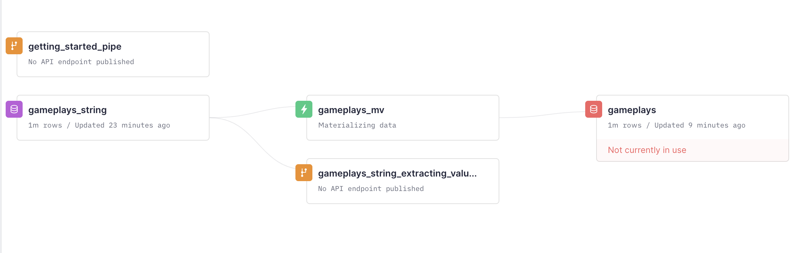

## Installation

Create a virtual environment and install the necessary packages

```bash
python3 -mvenv .e # creates environment in
 .e/bin/activate # activates environment
pip install -r requirements.txt
```

## Generating data

Run `jupyter notebook` and run the `Generating data.ipynb` notebook. You can play with the `num_games`, `num_teams` and `num_players` variables in it.

I created 1M gameplays for 10k players in 500 teams.

## The Tinybird project

### Generating the project structure
Runnig `tb init` will create the `datasources`, `endpoints`, `explorations` and `pipes` folders.

### Authenticating to your Tinybird account
Running `tb auth` will ask you for your admin token and will show you a link to https://ui.tinybird.co/tokens to copy it from there.

Then it'll create a `.tinyb` file in the directory you are with that info.


### Analyzing a data file to generate a Data Source schema
This is done by running `tb datasource generate <filename/url>`. In this case I did it from a local file. 

#### If your data is in CSV
If your data is already in a CSV format, like in `gameplays_sample.csv`, you'd just run `tb datasource generate gameplays_sample.csv`. This would be the output:

```bash
> tb datasource generate gameplays_sample.csv
** Generated datasources/gameplays_sample.datasource
** => Create it on the server running: $ tb push datasources/gameplays_sample.datasource
** => Append data using: $ tb datasource append gameplays_sample gameplays_sample.csv`

** => Generated fixture datasources/fixtures/gameplays_sample.csv
```

This would be the contents of the `datasources/gameplays_sample.datasource` schema file just created. In infers column types automatically, and you can change those just by editing that file.

#### If your data is in JSON

If your data is in a NDJSON format, like in `gameplays_sample.ndjson`, you'd need to convert it to a single String column CSV file and then you'd create a materialized view on Tinybird to extract each value from that String column.

You can convert an `.ndjson` file to a CSV file with just 1 column with `jq` running this:

```bash
jq -r '[. | tostring] | @csv' gameplays_sample.ndjson  > gameplays_sample_string.csv
```

Basically what it does is escaping every double quotes and enclosing each line in double quotes.

Then you can generate the schema for the Data Source doing `tb datasource generate gameplays_string.csv` and this would be the file generated:

```sql
DESCRIPTION generated from gameplays_string.csv

SCHEMA >
    `column_00` String
```

I'd change the `column_00` name to someting like `value`

### Ingesting data to Tinybird

For the rest of this I assumed your data is in NSJSON file.

Create the Data Source on Tinybird with `tb push <datasource_file>`:
```shell
> tb push datasources/gameplays_string.datasource 
** Processing datasources/gameplays_string.datasource
** Building dependencies
** Running gameplays_string 
** 'gameplays_string' created
** Not pushing fixtures
```

Append data to it running `tb datasource append <datasource_name> <file>`. You'll see this then:

```shell
> tb datasource append gameplays_string gameplays_string.csv
** 🥚 starting import process
** 🐥 done
** Total rows in gameplays_string: 1000000
** Data appended to data source 'gameplays_string' successfully!
** Data pushed to gameplays_string
```

### Extracting data from the gameplays_string Data Source

The `gameplays_string` Data Source has a String column where we store a JSON per gameplay. A Pipe like this extract each value from that JSON into a separate column:

```sql
NODE extract_values
SQL >

    SELECT 
        JSONExtractString(value, 'nick') nick,
        JSONExtractString(value, 'team') team,
        JSONExtractString(value, 'game') game,
        FROM_UNIXTIME((toInt64(JSONExtractInt(value, 'datetime') / 1000))) datetime,
        JSONExtract(value, 'score', 'UInt64') score
    FROM gameplays_string
TYPE materialized
DATASOURCE gameplays
```

To push it to Tinybird, as well as all the needed dependencies and populate the view, we run `tb push pipes/gameplays_mv.pipe --populate --push-deps`

This is how the Data Flow graph in your account would look after this


